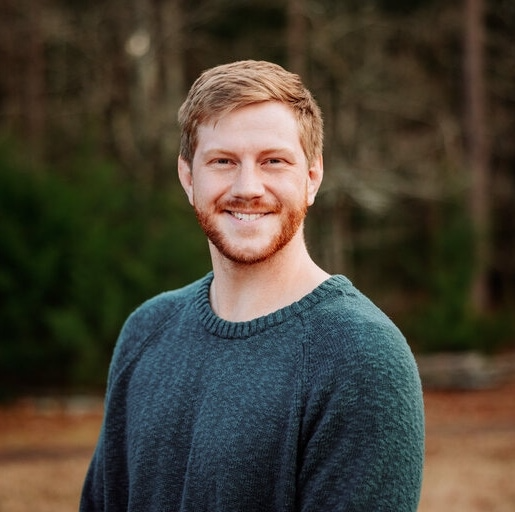

::: {.masthead}
::: {.masthead-text}
[Peter T. Tanksley]{.masthead-name}

[]{.belt-bar}

[Research Scientist, ALERRT Center · Texas State University]{.masthead-role}

::: {.masthead-thesis}
I study the people who run toward emergencies. Most of my work asks how the job of a first responder shapes health and mortality, using national death-certificate data, biomarkers, and the occasional survey experiment. The rest asks how police are trained, how they decide under pressure, and what the public makes of those decisions.
:::

::: {.masthead-links}
[ Email](mailto:peter_tanksley@txstate.edu) [ Scholar](https://scholar.google.com/citations?user=YnIBrB8AAAAJ&hl=en) [ ORCID](https://orcid.org/0000-0002-3449-2838) [ GitHub](https://github.com/petertanksley) [ CV](2_cv/tanksley_cv.qmd)
:::
:::

::: {.masthead-photo}
{fig-alt="Headshot of Peter T. Tanksley"}
:::
:::

What I work on

::: {.pillars}
::: {.pillar}
### First responder health and mortality
How law enforcement officers, firefighters, and other first responders die, and what in the work gets them there. Population-wide surveillance data, cardiometabolic biomarkers, and the policy that follows.

[Read more →](research.qmd#health){.more}
:::

::: {.pillar}
### Police training and public opinion
How officers are trained to make high-stakes decisions, how those decisions are perceived by the public and by officers themselves, and where the two diverge.

[Read more →](research.qmd#training){.more}
:::
:::

Selected work

<ul class="worklist">
<li>2026<a href="https://www.nature.com/" class="work-title">Robust inference and widespread genetic correlates from a large-scale genetic association study of human personality</a>Nature (forthcoming)Schwaba, Clapp Sullivan, Akingbuwa, Ilves, Tanksley, et al.</li>
<li>2026<a href="https://doi.org/10.1097/JOM.0000000000003792" class="work-title">Inflammation on the frontlines: Linking salivary and blood biomarkers to cardiometabolic health and physical performance in firefighters</a>Journal of Occupational and Environmental MedicineMcAllister, Tanksley, Martaindale, DeArman, Samora, Martin, &amp; Gonzalez</li>
<li>2026<a href="https://doi.org/10.1016/j.jcrimjus.2026.102601" class="work-title">Striking or grappling? Comparing public and officers' perceptions of police use of force</a>Journal of Criminal JusticeEleuterio-da-Rocha, Tanksley, Martaindale, Johncox, &amp; Blair</li>
<li>2025<a href="https://doi.org/10.1016/j.lana.2025.101270" class="work-title">Mortality among law enforcement officers in the United States: A population-wide analysis of the National Occupational Mortality Surveillance data, 2020–2023</a>The Lancet Regional Health – AmericasTanksley, Barnes, Blair, &amp; Martaindale</li>
</ul>

<a href="2_cv/tanksley_cv.qmd">Full CV →</a>

