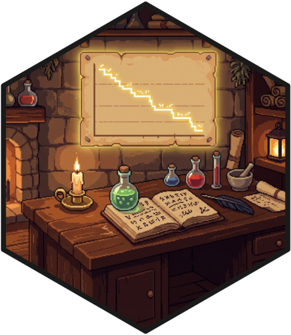
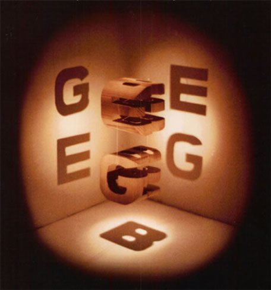

::: {.hex-mark}
{fig-alt="Pixel-art hex sticker: a candlelit desk in a stone study, a glowing survival curve pinned to the wall above it."}
:::

I work in the Research Ring of the [ALERRT Center](https://alerrt.org) at Texas State University, the group that trains law enforcement for active attacks and then studies, among other things, the people doing the responding. Our team's current projects are on the [ALERRT Research site](https://www.alerrt-research.org). Here is what I do there.

## First responder health and mortality {#health}

This is the center of my work. First responders are exposed to shift work, chronic stress, violence, and toxic environments, and the field has surprisingly little population-level evidence about what that exposure does over a career. My main source is national death-certificate data from the National Occupational Mortality Surveillance system, which lets me describe who dies of what and how that differs from comparable civilians. Biomarkers collected in the field (cardiometabolic, inflammatory) fill in the years before the death certificate, and policy data on presumptive workers' compensation laws tell us which of those differences anyone is actually doing something about.

<ul class="worklist">
<li>2025<a href="https://doi.org/10.1016/j.lana.2025.101270" class="work-title">Mortality among law enforcement officers in the United States: A population-wide analysis of the National Occupational Mortality Surveillance data, 2020–2023</a>The Lancet Regional Health – Americas</li>
<li>2026<a href="https://doi.org/10.1016/j.lana.2025.101330" class="work-title">Clarifying methods and interpretations in law enforcement mortality surveillance: Response to Kamal</a>The Lancet Regional Health – Americas</li>
</ul>

## Police training and public opinion {#training}

The ALERRT Center trains law enforcement for the worst days of their careers, and that gives us a rare view into how officers are taught to decide under pressure. I study the training itself (what transfers, what doesn't, how you would even measure it) and the public's reading of the decisions that come out the other end. Officers and civilians often watch the same encounter and see different things. Factorial survey experiments let us find exactly where the two audiences part ways.

<ul class="worklist">
<li>2026<a href="https://doi.org/10.1016/j.jcrimjus.2026.102601" class="work-title">Striking or grappling? Comparing public and officers' perceptions of police use of force</a>Journal of Criminal Justice</li>
<li>2026<a href="https://doi.org/10.1016/j.jcrimjus.2025.102578" class="work-title">Public opinion and the immediate entry dilemma: A factorial survey experiment on active shooter response</a>Journal of Criminal Justice</li>
</ul>

## Where I came from {#origins}

My CV reads like two careers stapled together, and in a sense it is. I trained as a criminologist, then spent a postdoc in a behavior-genetics lab studying polygenic scores and DNA methylation: how the biology of children and adolescents registers social disadvantage, and how much of the "genetic effect" in observational studies is really something else. That work is why I still think about health in biological terms, and why the first-responder research keeps reaching for biomarkers rather than stopping at self-report.

::: {.geb-figure}
{fig-alt="Cover of Gödel, Escher, Bach: a single carved wooden block lit from three directions, casting the shadows G, E, and B."}
:::

The habit I took from it is best explained by the cover of Hofstadter's *Gödel, Escher, Bach*: a single carved block that casts a different letter in each direction, depending on where you put the light. Genes, environment, behavior. Most research paradigms light two of the three and assume the third away. I have spent my career shifting the lamp around and asking what matters *from here*. And then from here. And then with two lamps at once. The first-responder work is that same habit pointed at a population that badly needs the attention.

<ul class="worklist">
<li>2024<a href="https://doi.org/10.1177/21677026241260260" class="work-title">Do polygenic indices capture 'direct' effects on child externalizing behavior? Within-family analyses in two longitudinal birth cohorts</a>Clinical Psychological Science</li>
<li>2023<a href="https://doi.org/10.1177/21677026231186802" class="work-title">Associations of DNA-methylation measures of biological aging with social disparities in child and adolescent mental health</a>Clinical Psychological Science</li>
</ul>
